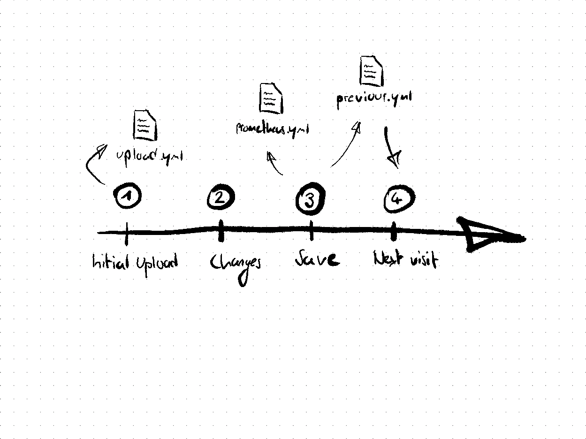

# Prometheus Configurator (.NET Core 3.1)

The Prometheus Configurator is a Blazor Plugin you can use to configure the Prometheus YAML config file with ease.
The plugin consists of some logic mostly embedded in a razor component, which offers an UI to create simple CRUD operations on the Prometheus config file.

## How To Use
> Long story short:
> 1. Upload your existing prometheus.yml configuration file using the **Upload Configuration Tab**
> 2. Make changes as you wish, using the UI of the configurator (each change is saved on button click)
> 3. When you're done, click the blue **Download Files** link to obtain a .zip which contains all the files you need

The Prometheus Configurator lets you manipulate a Prometheus configuration in a graphical way.
To do so, you first need to upload an already existing configuration (your "classic" prometheus.yml file) by switching to the **Upload Configuration**-Tab (click on the left arrow) and
uploading your existing configuration using the **Browse** and then the yellow **Upload** button. Once you've uploaded your config file, the configurator
creates an in-memory model, which you can manipulate on. You can add, update or remove scraping targets using the UI, feeding it the required information.
**Every action you take (Adding, Updating or Removing a scraping target) is saved immediately as you click the according button.** However, some people may want to do so manually, that's
why there is a save-button.

## How to implement
A few things to notice when implementing this plugin to your already existing Blazor solution:
- **Changes on the _Host.cshtml file**
  - I've added 3 script tags at the end of the _Host.cshtml file:
    - ``
    - ``
    - ``
  - The following  line needs to be added to the Startup.cs file:
    - `endpoints.MapControllerRoute("api",
      "{controller=ConfigurationController}/{action=Info"});`
- Make sure to adjust namespaces.
- Add the page to the Shared/NavMenu.razor to make it visible.
- Add the following line to your _Imports.razor
  - `@using BlazorInputFile`

## Dependencies
- [BlazorInputFile v.0.2.0](https://www.nuget.org/packages/BlazorInputFile)
- [Newtonsoft.Json v.13.0.1](https://www.nuget.org/packages/Newtonsoft.Json)
- [Tewr.Blazor.FileReader v.3.3.1.21360](https://www.nuget.org/packages/Tewr.Blazor.FileReader)
- [YamlDotNet v.11.2.1](https://www.nuget.org/packages/YamlDotNet)
- [Bootstrap 5](https://getbootstrap.com/docs/5.0/getting-started/introduction/) using [self compiled sass files](https://www.youtube.com/watch?v=9b4hYVNCFK4)

## Technical Background

On file upload, the application creates an in-memory JSON-model of the YML-content. The big advantage that emerges from converting
the content of the YML file into an in-memory JSON object is the ease of access to manipulation. JSON is, in contrast to YML, widely supported
in many programming languages such as C#. All changes from the user coming from the UI are performed on this model. When the user saves, the application
creates an updated prometheus.yml, as well as a previous_prometheus_config.yml. Whenever the page is refreshed, the application checks if a previous_prometheus_config.yml
is existing and loads this model into memory if so. This way, the application keeps track of the newest model at all times.

### Python Script Addition & Configuration Hosting

With this Blazor feature being possibly deployed in a business environment, the need for **automatic configuration scraping** arises.
The basic idea is the following:
- Your current configuration files _(all of them, the main prometheus.yml as well as any possible .json target file)_ are hosted on Blazor.
  - Changes are reflected immediately
  - To keep things tight, every configuration file is stuffed inside one single JSON object. This JSON object is then made available on the **/getConfig** endpoint.
- The additional Python script can be deployed on any server running Prometheus.
  - This script can be set up as a service or a scheduled task.
  - It takes the base url of your Blazor webpage as a **must-have command line argument** for execution
  - When fired, the script matches the MD5-hash of your local prometheus.yml file to the one **available on the /getChecksum** endpoint.
  - If the script detects a change (hence different MD5 hashes), it creates a backup of the local configuration files, downloads the new ones from your Blazor server and puts them in place.

Logging is enabled to the warning-level, should you experience any kind of error. To prevent any damage on your running Prometheus instance, the script exits when the request to your Blazor
server returns anything else than HTTP 200.

